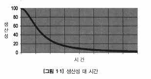

# 🪥 Chapter 01 - 깨끗한 코드

> 여러분이 이 책을 읽고 있다면 이유는  두 가지다. 첫째, 프로그래머라서. 둘째, 더 나은 프로그래머가 되려고. 다행이다! 우리 업계는 더 나은 프로그래머가  필요하니까.

## 코드가 존재하리라

* 코드의 종말이 다가왔다? 자동으로 코드를 생산하며 프로그래머는 필요없다고 주장하는 사람들(?)
  * 헛소리다. 코드는 요구사항을 상세히 표현하는 수단이므로 사라질일이 없다.
  * 고도로 추상화된 언어나 특정 응용 분야 언어로 기술하는 명세 역시 코드다.
  * 코드는 요구사항을 표현하는 언어이다. 요구사항을 정밀한 표현이 필요하다. 기계로 대체가 불가하다.

## 나쁜 코드

* 나쁜코드는 한 회사를 망하게 할 정도로 영향을 끼친다.
  * 시간에 쫒겨 현재만을 위해 짠 코드
  * 지겨워서 대충 짠 코드
  * 상사에게 욕 먹을까봐 대충 만든 코드
* 구성원 모두가 대충 짠 프로그램이 돌아간다는 사실에 안도감을 느끼며 그래도 안 돌아가는 프로그램보다 낫다고 스스로를 위로한 경험이 있다. 나중에 다시 정리하겠다고 다짐하며..

> 물론 그때 그 시절 우리는 르블랑의 법칙을 몰랐다. "나중은 결코 오지 않는다."

## 나쁜 코드로 치르는 대가

* 나쁜코드는 '해독' 의 과정을 거쳐야 하므로, 팀 전체의 생산성을 저하 시킨다.

<figure><figcaption>
CleanCode 중 그림 1.1
</figcaption></figure>

### 원대한 재설계의 꿈

* 팀이 한계에 봉착하고, 재 설계 및 개발을 요구한다.
* 관리자는 리소스를 사용하기 싫지만 현재 나쁜코드로인한 생산성이 바닥이라 거부할 도리가 없다.
* 새로운 타이거 팀이 구성되어 새롭게 시스템을 개발하여 기존시스템 + 새시스템 을 만든다
* 기존 팀은 기존의 시스템을 유지보수한다.
* 두팀은 경주 하듯 경쟁한다.
* 타이거 팀이 기존팀의 시스템을 따라잡을 즈음에는 초장기 타이거 팀원들도 팀을 대부분 떠났고 새로운 팀원들이 새 시스템을 설계 하자고 나선다. 무한굴레...

> 시간을 들여 깨끗한 코드를 만드는 노력이 비용을 절감하는 방법일 뿐만 아니라 전문가로서 살아남는 길이라는 사실

### 태도

* 예상보다 업무기일에 차질이 생긴경우 우리는 아래와 같은 온갖 핑계를 댄다
  * 한줄만 고치면 될꺼라 생각했다가 모듈을 수백 개 건드렸다.
  * 설계와 다르게 요구사항이 변했다.
  * 일정이 촉박했다.
  * 답답한 관리자와 고객때문이다.
* 전적으로 잘못은 프로그래머에게..
  * 사용자는 우리에게 현실성을 자문하고, 우리가 일정을 잡으며, 프로젝트 계획에 우리가 깊숙히 관여한다.
  * 그들이 일정과 요구사항을 강력하게 밀어붙이는 이유는 그것이 그들의 책임이기 때문이다.

> 나쁜 코드의 위험을 이해하지 못하는 관리자 말을 그대로 따르는 행동은 전문가답지 못하다.

### 원초적 난제

* 나쁜 코드는 생산성을 감소시킨다 < - > 기한을 맞추려면 나쁜코드로 할 수 밖에 없다.

### 깨끗한 코드라는 예술

